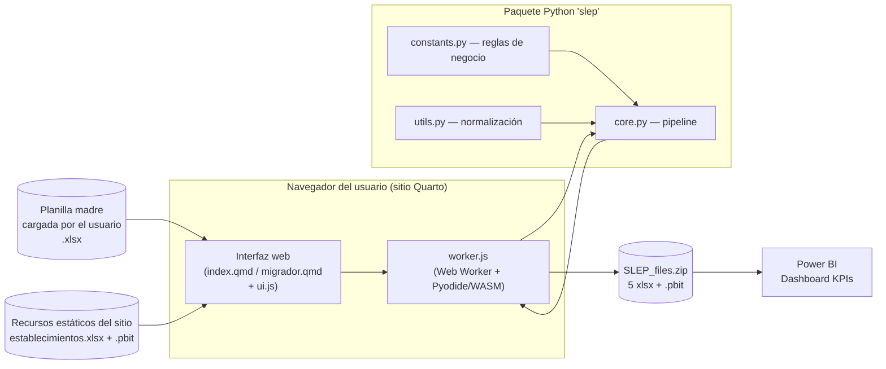
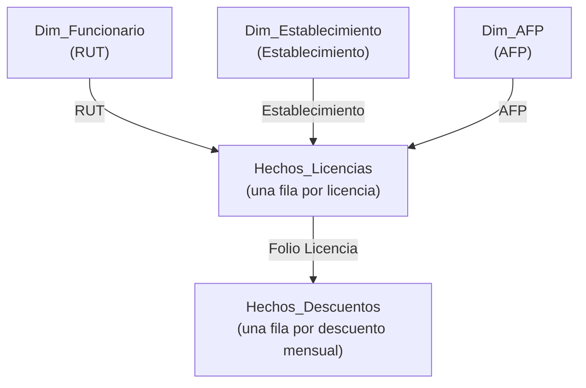

# Automatización de Reportes de Licencias Médicas — SLEP Los Libertadores

> **Servicio Local de Educación Pública Los Libertadores**  
> Procesador de datos históricos de licencias médicas con normalización, validación cruzada y generación de modelo estrella para Power BI.
>
> **URL de uso:** [adolforv.github.io/repositorio-SLEP/](https://adolforv.github.io/repositorio-SLEP/)

---

## Tabla de contenidos

- [Resumen](#resumen)
- [Arquitectura](#arquitectura)
- [Stack tecnológico](#stack-tecnológico)
- [Cómo usar](#cómo-usar)
- [Entrada esperada](#entrada-esperada)
- [Salidas generadas](#salidas-generadas)
- [Reglas de negocio principales](#reglas-de-negocio-principales)
- [Riesgos conocidos](#riesgos-conocidos)
- [Licencia](#licencia)

---

## Resumen

Este proyecto moderniza la gestión de licencias médicas del SLEP Los Libertadores, migrando desde una planilla Excel histórica con problemas de calidad de datos hacia un **modelo de datos normalizado** (esquema estrella) listo para análisis en Power BI.

### El problema 

- **Incoherencias**: datos redundantes y contradictorios entre hojas de distintos años.
- **Errores de entrada**: múltiples variantes ortográficas para un mismo establecimiento, institución, resolución o tipo de licencia ("FONASA", "fonasa", "Fonasa "…).
- **Procesos manuales**: reportar e imputar licencias exigía edición manual exhaustiva y propensa a errores.

### La solución

La herramienta funciona como un **procesador de datos inteligente** que corre 100 % en el navegador (sin servidor). El usuario solo debe cargar su **planilla madre** de licencias y el sitio descarga automáticamente el maestro de establecimientos y la plantilla de Power BI desde los recursos estáticos del repositorio. Al finalizar, devuelve un archivo ZIP con cinco archivos Excel normalizados y un dashboard listo para usar.

1. **Normaliza** automáticamente errores ortográficos y variantes de escritura mediante expresiones regulares y fuzzy matching.
2. **Valida cruzadamente** la información entre tablas (funcionarios, establecimientos, AFPs) y reporta anomalías.
3. **Genera reportes listos para usar**: planillas con alertas de inconsistencias, campos autorrellenados y listas desplegables para la imputación final.

---

## Arquitectura

### Flujo de datos

1. El usuario abre la página del migrador y **carga únicamente su planilla madre** de licencias (`.xlsx`).
2. El sitio descarga automáticamente desde sus recursos estáticos:
   - El **maestro de establecimientos** (`assets/tables/establecimientos.xlsx`).
   - La **plantilla de Power BI** (`assets/Dashboard_Licencias.pbit`), si está disponible.
3. El *worker* invoca `slep.procesar(...)` y muestra en pantalla el **log** de clasificación e inconsistencias.
4. El usuario descarga `SLEP_files.zip` con los cinco archivos normalizados (+ dashboard).
5. Los archivos se usan como nueva planilla madre de imputación y como fuente del dashboard de Power BI.

### Decisiones de diseño clave

- **Sin servidor**: al correr en Pyodide/WASM, el procesamiento es 100 % local. Los archivos del usuario **no salen de su computador**.
- **Excel como interfaz de datos**: en vez de imponer un sistema nuevo, la herramienta lee y escribe el formato que el equipo ya domina.
- **Reglas declarativas separadas del código**: todas las expresiones regulares y catálogos viven en `constants.py`, de modo que ajustar una regla de negocio no requiere tocar la lógica.

---

## Stack tecnológico

| Capa | Tecnología | Rol |
|---|---|---|
| **Interfaz y documentación** | [Quarto](https://quarto.org/) (HTML/CSS/JS) | Sitio web del proyecto: página de inicio, documentación y pantalla del migrador (`migrador.qmd`) |
| **Ejecución en el navegador** | JavaScript (`assets/ui.js`, `assets/worker.js`) + Pyodide | El Python corre **dentro del navegador** compilado a WebAssembly |
| **Motor de procesamiento** | Python 3, paquete `slep` (`scripts/slep/`) | Toda la lógica de migración, normalización y generación de archivos |
| **Almacenamiento** | Excel (`.xlsx`) | Única fuente de entrada y formato de salida |
| **Análisis** | Power BI (`.pbit`) | Dashboard de KPIs de licencias que consume los cinco archivos generados |

---

## Cómo usar

### Requisitos

- Navegador con soporte para Web Workers y WebAssembly (Chrome, Edge, Firefox, Safari).
- Conexión a Internet para Pyodide (~20-30 segundos la primera vez).

### Pasos

1. Abrir la página del migrador:  
   **[adolforv.github.io/repositorio-SLEP/migrador.html](https://adolforv.github.io/repositorio-SLEP/migrador.html)**
2. Arrastrar o seleccionar la **planilla madre** de licencias (`.xlsx`).  
   > No es necesario cargar nada más: el maestro de establecimientos y la plantilla Power BI se descargan automáticamente desde el sitio.
3. Presionar **"Procesar y descargar"**.
4. Revisar el log en pantalla: muestra folios repetidos, valores clasificados, inconsistencias detectadas y establecimientos nuevos.
5. Descargar `SLEP_files.zip` con los cinco archivos normalizados.

> **Nota**: el procesamiento tiene un timeout de 2 minutos. Si el worker no responde, se ofrece la opción de reintentar.

---

## Entrada esperada

### Planilla madre de licencias (`.xlsx`)

Único archivo que el usuario debe cargar. Debe contener las siguientes hojas:

| Hoja | Obligatoria | Estructura esperada |
|---|---|---|
| `DATOS` | Sí | Encabezados en **fila 1**: `RUN`, `Nombre`, `Fecha Nacimiento`, `Sexo`, `Estado Civil`, `Dirección`, `Comuna`, `Teléfono`, `Teléfono Emergencia`, `Nacionalidad`, `Formación Profesional`, `Cargo`, `Centro de Costo`. Un funcionario por fila. |
| `LM01-2024` | Sí | Encabezados en **fila 2**; se usa su columna `Unidad` (desde fila 3) como fuente adicional de establecimientos. |
| `LM*` (resto) | Al menos una | Hojas de hechos. La fila de encabezado se detecta automáticamente entre las filas 1 y 2 buscando una celda que contenga "rut". |

**Tolerancias del lector** (nombres de columna alternativos aceptados en las hojas de hechos):

| Concepto | Encabezados aceptados |
|---|---|
| Folio | `Folio licencia`, `Folio Minsal` |
| Fechas | `Fecha Inicio` / `Fech. Inicio`, `Fecha Termino` / `Fech. Termino` |
| Días | `Días LM`, `Días Lic` |
| Institución | `Institución Salud`, `Institucion Salud` |
| Estado | `Resolución Médica`, `Resolucion Medica` (con *fallback* a `Estado`) |
| Establecimiento | `Estableciemiento` *(sic, error histórico)*, `Establecimiento`, `Unidad`, `Centro de Costo`, `Lugar`, `Sede`, `Ubicacion` |
| AFP | `A.F.P.` |

> **Nota técnica**: los libros se leen con `data_only=True`, es decir, se toma el **último valor calculado** por Excel de cada celda, no las fórmulas.

---

## Salidas generadas

`procesar()` devuelve un paquete de archivos (todo se entrega comprimido en **`SLEP_files.zip`**):

| Archivo | Tipo | Contenido |
|---|---|---|
| `01_Dim_Funcionario.xlsx` | Dimensión | Funcionarios (incluye placeholders para RUT no encontrados), ordenados por nombre. |
| `02_Dim_Establecimiento.xlsx` | Dimensión | Maestro de establecimientos + los **nuevos** detectados (Tipo "Otro"). |
| `03_Dim_AFP.xlsx` | Dimensión | Combinaciones AFP + Tasa observadas (con centinela `-1` para tasas desconocidas). |
| `04_Hechos_Licencias.xlsx` | **Hechos** | Licencias migradas deduplicadas **+ 40 filas en blanco** para imputar nuevas, con autorrelleno y validaciones. |
| `05_Hechos_Descuentos.xlsx` | Hechos | Descuentos en formato largo (Folio, RUT, Período `YYYY-MM`, Monto, Fuente). |
| `Dashboard_Licencias.pbit` | Plantilla | Dashboard de Power BI (solo si la plantilla está disponible en el sitio). |

Todos los `.xlsx` salen con formato corporativo: encabezado azul congelado, bordes, autoancho y **tabla nativa de Excel** (filtros incluidos), listos para conectar a Power BI.

### Modelo estrella

Relaciones en Power BI:

- `Hechos_Licencias.RUT → Dim_Funcionario.RUT`
- `Hechos_Licencias.Establecimiento → Dim_Establecimiento.Establecimiento`
- `Hechos_Licencias.A.F.P. → Dim_AFP.AFP`
- `Hechos_Descuentos.Folio Licencia → Hechos_Licencias.Folio Licencia`

---

## Reglas de negocio principales

Cada regla tiene un identificador **RB-*** que aparece también como comentario en el código Python (`# RB-04`, etc.), trazable desde el documento técnico.

| ID | Regla | Descripción |
|---|---|---|
| RB-01 | Normalización canónica de texto | `utils.norm()` — quita tildes, minúsculas, espacios múltiples, normaliza "n°". |
| RB-02 | Normalización de RUT | `utils.norm_rut()` — reconstruye como `NNNNNNNN-DV` en mayúsculas; **no valida DV** para conservar trazabilidad. |
| RB-03 | Errores de Excel = vacío | `#N/A`, `#REF!`, `#VALUE!`, etc. se tratan como vacío. |
| RB-04 | Clasificación en cascada | Regex → fuzzy (≥ 0,6) → "REVISAR: no reconocido". |
| RB-05 | Resoluciones legacy | Números de resolución en columna "Resolución Médica" se dejan vacíos con marca informativa. |
| RB-06 | Parseo AFP "Nombre (tasa)" | Separa nombre y tasa de cotización entre paréntesis. |
| RB-07 | Imputación de tasas AFP | Hereda tasa conocida del histórico; si no existe, centinela `-1`. |
| RB-08 | Establecimientos: 4 niveles | Exacto → regex → fuzzy (≥ 0,82) → nuevo (Tipo "Otro"). |
| RB-09 | Identificación del funcionario | RUT exacto → nombre difuso (≥ 0,85) → placeholder. |
| RB-10 | Deduplicación de hechos | Clave `(RUT, Folio, Fecha Inicio)`; gana la fuente de **mayor año**. |
| RB-11 | Montos dobles | Sistema vs. Pagado (2024 / 2025-2026) en 8 columnas. |
| RB-12 | Descuentos por período | Formato ancho (`MONTO DESCONTADO MES AÑO`) → largo (`YYYY-MM`). |
| RB-13 | Fecha término < inicio | Se conserva la fila pero se anota inconsistencia. |
| RB-14 | Detección automática de encabezados | Hojas de hechos: filas 1-2 buscando "rut"; maestro: primeras 4 filas buscando "Tipo". |
| RB-15 | Filas sin RUT ni folio | Se omiten (no trazables). |
| RB-16 | Lectura con `data_only=True` | Se leen valores calculados, no fórmulas. |

---

## Riesgos conocidos

- **Correcciones fuzzy no son verdad absoluta**: todo lo marcado "Corregido (revisar)" debe auditarse; un umbral de 0,6 puede atraer valores a la categoría equivocada en textos muy cortos.
- **El orden de las regex es significativo**: un patrón amplio declarado antes puede "capturar" un texto que debía ir a otra categoría.
- **Duplicados por folio compartido**: si dos licencias *distintas* compartieran RUT + Folio + Fecha Inicio, la deduplicación (RB-10) conservaría solo una. El log de folios repetidos es la herramienta para detectar estos casos.
- **Dependencia de convenciones de la planilla madre**: nombres de hoja `LM*`, fila de encabezado con "rut", columnas con los alias conocidos. Una planilla que se salga de estas convenciones puede requerir ajustes.
- **Tasa centinela `-1`**: indica AFP reconocida cuya tasa nunca apareció en el histórico; debe completarse en `Dim_AFP` antes de usar montos calculados con ella.
- **El RUT no valida dígito verificador** (RB-02): un RUT mal digitado en el origen se propaga tal cual para no perder trazabilidad.

---

## Licencia

Proyecto interno del Servicio Local de Educación Pública Los Libertadores. Uso exclusivo para la gestión de licencias médicas de la organización.

---

*Documento actualizado a julio de 2026. Ante cualquier discrepancia entre este README y el código fuente, el código es la fuente de verdad.*
