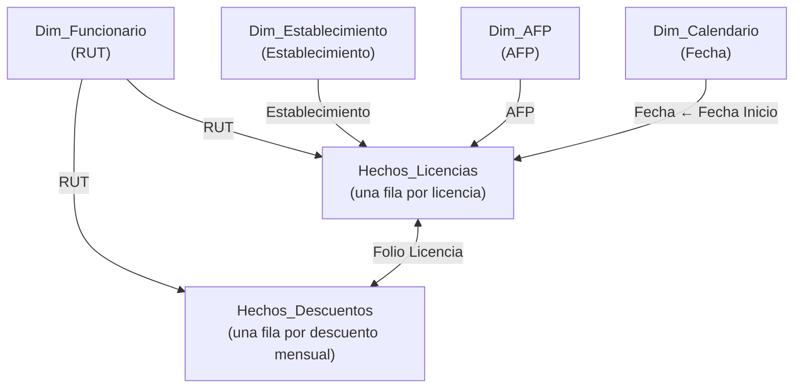

**Servicio Local de Educación Pública Los Libertadores**

| | |
|---|---|
| **Proyecto** | Automatización de Reportes de Licencias Médicas |
| **Componente** | Paquete Python `slep` (migración y normalización de datos) |
| **Audiencia** | Equipo de gestión de personas (negocio) y equipo técnico (TI) |

---

# Tabla de contenidos

1. [Introducción](#introducción)
2. [Arquitectura tecnológica](#arquitectura-tecnológica)
3. [Estructura del código](#estructura-del-código)
4. [El pipeline paso a paso](#el-pipeline-paso-a-paso)
5. [Entradas esperadas](#entradas-esperadas)
6. [Catálogo de reglas de negocio y estandarizaciones](#catálogo-de-reglas-de-negocio-y-estandarizaciones)
7. [Salidas generadas](#salidas-generadas)
8. [Modelo estrella y Power BI](#dashboard-de-power-bi)
9. [Guía de mantenimiento](#guía-de-mantenimiento)
10. [Riesgos conocidos y limitaciones](#riesgos-conocidos-y-limitaciones)
11. [Glosario](#glosario)
12. [Anexo — Convenciones de documentación del código](#anexo-convenciones-de-documentación-del-código)

---

# 1. Introducción

## 1.1 Propósito de este documento

Este documento explica, para el equipo del SLEP Los Libertadores, **cómo está implementada la herramienta de migración de licencias médicas**, qué arquitectura tecnológica utiliza y **qué reglas de negocio, expresiones regulares y estandarizaciones aplica** sobre los datos históricos. Busca que cualquier persona del equipo pueda entender qué hace la herramienta con sus datos, y que el equipo técnico pueda mantenerla.

## 1.2 Contexto y problema

El registro de licencias médicas se llevaba históricamente en una planilla Excel ("planilla madre"), con problemas típicos de escalabilidad y calidad de datos:

- **Incoherencias**: datos redundantes y contradictorios entre hojas de distintos años.
- **Errores de entrada**: múltiples variantes ortográficas para un mismo establecimiento, institución o tipo de licencia ("FONASA", "fonasa", "Fonasa "…).
- **Procesos manuales**: reportar e imputar licencias exigía edición manual exhaustiva y propensa a errores.

## 1.3 Qué hace la herramienta

La herramienta funciona como un **procesador de datos inteligente**. Recibe la planilla madre histórica (desde 2024) más una tabla maestra de establecimientos, y devuelve un archivo ZIP con un **modelo de datos normalizado** (esquema estrella) de cinco archivos Excel:

1. **Normaliza** automáticamente errores ortográficos y variantes de escritura.
2. **Valida cruzadamente** la información entre tablas (funcionarios, establecimientos, AFPs) y reporta anomalías.
3. **Genera reportes listos para usar**: planillas con alertas de inconsistencias, campos autorrellenados y listas desplegables para la imputación final, más un dashboard de Power BI.

---

# 2. Arquitectura tecnológica

## 2.1 Vista general

```{mermaid}
flowchart LR
    subgraph Navegador["Navegador del usuario (sitio Quarto)"]
        UI["Interfaz web<br/>(index.qmd / migrador.qmd<br/>+ ui.js)"]
        W["worker.js<br/>(Web Worker + Pyodide/WASM)"]
    end
    subgraph Paquete["Paquete Python 'slep'"]
        C["core.py<br/>pipeline"]
        K["constants.py<br/>reglas de negocio"]
        U["utils.py<br/>normalización"]
    end
    IN1[("Planilla madre<br/>.xlsx")]
    RES[("Recursos estáticos del sitio<br/>establecimientos.xlsx + .pbit")]
    OUT[("SLEP_files.zip<br/>5 xlsx + .pbit")]
    PBI["Power BI<br/>Dashboard KPIs"]

    IN1 --> UI
    RES --> UI
    UI --> W --> C
    K --> C
    U --> C
    C --> W --> OUT
    OUT --> PBI
```

## 2.2 Componentes

| Componente | Tecnología | Rol |
|---|---|---|
| **Interfaz y documentación** | [Quarto](https://quarto.org/) (HTML/CSS/JS) | Sitio web del proyecto: página de inicio, documentación y pantalla del migrador (`migrador.qmd`) |
| **Ejecución en el navegador** | JavaScript (`assets/ui.js`, `assets/worker.js`) + Pyodide | El Python corre **dentro del navegador** compilado a WebAssembly: los archivos no salen del computador del usuario, no se necesita servidor |
| **Motor de procesamiento** | Python 3, paquete `slep` (`scripts/slep/`) | Toda la lógica de migración, normalización y generación de archivos. **Es el componente documentado aquí** |
| **Almacenamiento** | Excel (`.xlsx`) | Única fuente de entrada y formato de salida; actúa como "base de datos" del proceso |
| **Análisis** | Power BI (`.pbit`) | Dashboard de KPIs de licencias que consume los cinco archivos generados |

**Decisiones de diseño relevantes (TI):**

- **Sin servidor**: al correr en Pyodide/WASM, el procesamiento es 100 % local. Por eso el paquete opera sobre `bytes` en memoria (`io.BytesIO`) y no usa disco ni red.
- **Excel como interfaz de datos**: en vez de imponer un sistema nuevo, la herramienta lee y escribe el formato que el equipo ya domina, con tablas nativas, validaciones y fórmulas de autorrelleno.
- **Reglas declarativas separadas del código**: todas las expresiones regulares y catálogos viven en `constants.py`, de modo que ajustar una regla de negocio no requiere tocar la lógica.
- **Rendimiento en WASM**: se usan patrones eficientes para Pyodide (`iter_rows`, precálculo de índices de columnas una sola vez por hoja, lectura con `data_only=True`).

## 2.3 Flujo de datos

1. El usuario abre la página del migrador (`migrador.html`) y **carga únicamente su planilla madre** de licencias (`.xlsx`).
2. El sitio descarga automáticamente desde sus recursos estáticos el **maestro de establecimientos** (`assets/tables/establecimientos.xlsx`) y la **plantilla de Power BI** (`assets/Dashboard_Licencias.pbit`), si está disponible.
3. El *worker* invoca `slep.procesar(...)` y muestra en pantalla el **log** de clasificación e inconsistencias.
4. El usuario descarga `SLEP_files.zip` con los cinco archivos normalizados (+ dashboard).
5. Los archivos se usan como nueva planilla madre de imputación y como fuente del dashboard de Power BI.

---

# 3. Estructura del código

El paquete `slep` tiene cuatro módulos con responsabilidades claramente separadas:

| Archivo | Responsabilidad | ¿Qué contiene? |
|---|---|---|
| `__init__.py` | API pública | Expone una única función: `procesar(...)` |
| `constants.py` | **Reglas de negocio declarativas** | Todas las expresiones regulares y mapas de canonización (tipos de licencia, instituciones, resoluciones, establecimientos, AFP, meses, errores de Excel) |
| `utils.py` | Normalización de bajo nivel | `norm()` (texto), `norm_rut()` (RUT), detección de errores de Excel |
| `core.py` | Pipeline completo | Clasificadores, lectores, migración de hechos/descuentos, escritura de los cinco archivos y la función orquestadora `procesar()` |

Mapa de funciones de `core.py` por etapa:

| Etapa | Funciones |
|---|---|
| Clasificación | `_match_canon`, `clasificar_generico`, `clasificar_resolucion`, `clasificar_afp`, `clasificar_establecimiento`, `generar_listas_canonicas`, `extraer_valores_unicos` |
| Lectura | `leer_fuente`, `leer_dim_establecimiento` |
| Transformación | `migrar_hechos`, `migrar_descuentos`, `construir_dim_afp`, `extraer_montos_dobles` |
| Escritura | `escribir_dim_funcionario`, `escribir_dim_establecimiento`, `escribir_dim_afp`, `escribir_hechos`, `escribir_hechos_descuentos` (+ utilidades `_estilizar_header`, `_autoancho`, `_escribir_dim`, `_add_ref`, `_add_dv`) |
| Orquestación | `procesar` (punto de entrada único) |

---

# 4. El pipeline paso a paso

`procesar(src_bytes, dim_est_bytes, log_callback=None, pbit_data=None)` ejecuta las siguientes etapas:

```{mermaid}
flowchart TD
    A["leer_fuente()<br/>planilla madre"] --> D
    B["leer_dim_establecimiento()<br/>tabla maestra"] --> D
    D["Reporte de folios repetidos<br/>(advertencia de duplicados)"] --> E
    E["generar_listas_canonicas()<br/>log de clasificación crudo → canónico"] --> F
    F["migrar_hechos()<br/>consolidación + deduplicación"] --> G
    G["migrar_descuentos()<br/>formato ancho → largo"] --> H
    H["construir_dim_afp()<br/>AFPs y tasas observadas"] --> I
    I["escribir_*()<br/>5 archivos + ZIP"] --> J["SLEP_files.zip"]
```

1. **Lectura** de la planilla madre: hoja `DATOS` (funcionarios), hoja `LM01-2024` (unidades/centros de costo) y todas las hojas `LM*` (hechos de licencias).
2. **Lectura** del maestro de establecimientos.
3. **Diagnóstico de folios repetidos** entre hojas (se reporta en el log cuántos folios aparecen más de una vez).
4. **Clasificación canónica**: se extraen todos los valores crudos únicos de Tipo de Licencia, Institución de Salud y Resolución Médica, se clasifican y se emite al log el detalle `canónico ← [variantes crudas]`, incluyendo lo que quedó `SIN CLASIFICAR`.
5. **Migración de hechos**: canonización fila a fila, cruce con funcionarios, extracción de montos y **deduplicación** (gana la fuente más reciente). Las inconsistencias se acumulan por fila.
6. **Migración de descuentos**: pivoteo de las columnas mensuales a una tabla por período.
7. **Dimensión AFP**: combinaciones AFP+tasa observadas, con reglas de imputación.
8. **Escritura**: los cinco `.xlsx` con formato, validaciones y fórmulas, más el `.zip` (y el `.pbit` si se entregó).

El log que emite el pipeline es la **primera herramienta de auditoría**: muestra cuántos funcionarios se leyeron, cuántos folios estaban repetidos, qué valores crudos mapearon a cada categoría canónica, cuáles quedaron sin clasificar y qué establecimientos nuevos requieren revisión.

---

# 5. Entradas esperadas

## 5.1 Planilla madre de licencias (`.xlsx`)

Único archivo que el usuario debe cargar. Debe contener las siguientes hojas:

| Hoja | Obligatoria | Estructura esperada |
|---|---|---|
| `DATOS` | Sí | Encabezados en **fila 1**: `RUN`, `Nombre`, `Fecha Nacimiento`, `Sexo`, `Estado Civil`, `Dirección`, `Comuna`, `Teléfono`, `Teléfono Emergencia`, `Nacionalidad`, `Formación Profesional`, `Cargo`, `Centro de Costo`. Un funcionario por fila |
| `LM01-2024` | Sí | Encabezados en **fila 2**; se usa su columna `Unidad` (desde fila 3) como fuente adicional de establecimientos |
| `LM*` (resto) | Al menos una | Hojas de hechos. La fila de encabezado se detecta automáticamente entre las filas 1 y 2 buscando una celda que contenga "rut" |

**Tolerancias del lector de hechos** (nombres de columna alternativos aceptados):

| Concepto | Encabezados aceptados |
|---|---|
| Folio | `Folio licencia`, `Folio Minsal` |
| Fechas | `Fecha Inicio` / `Fech. Inicio`, `Fecha Termino` / `Fech. Termino` |
| Días | `Días LM`, `Días Lic` |
| Institución | `Institución Salud`, `Institucion Salud` |
| Estado | `Resolución Médica`, `Resolucion Medica` (con *fallback* a `Estado`) |
| Establecimiento | `Estableciemiento` *(sic, error histórico de la planilla)*, `Establecimiento`, `Unidad`, `Centro de Costo`, `Lugar`, `Sede`, `Ubicacion` |
| AFP | `A.F.P.` |

> **Nota**: los libros se leen con `data_only=True`, es decir, se toma el **último valor calculado** por Excel de cada celda, no las fórmulas (ver RB-16 y RB-03).

### Recursos descargados automáticamente por el sitio

El usuario **no necesita cargar** los siguientes archivos; el migrador los descarga automáticamente desde los recursos estáticos del sitio:

| Recurso | Ubicación en el sitio | Descripción |
|---|---|---|
| Maestro de establecimientos | `assets/tables/establecimientos.xlsx` | Primera hoja del libro; la fila de encabezado se detecta dentro de las primeras 4 filas buscando la celda `Tipo`. Columnas esperadas: `Tipo`, `Nombre establecimiento`, `Comuna`, `Dirección`, `Telefono`, `Sitio web`. Nombres duplicados se ignoran (gana la primera aparición). |
| Plantilla Power BI | `assets/Dashboard_Licencias.pbit` | Dashboard de KPIs; se incluye en el ZIP de salida si está disponible. |

---

# 6. Catálogo de reglas de negocio y estandarizaciones

Esta es la sección central del documento. Cada regla tiene un identificador **RB-\***, que también aparece como comentario en el código (`# RB-04`, por ejemplo), de modo que siempre se puede ir de la regla al punto exacto donde se aplica.

**Resumen del catálogo:**

| ID | Regla | Dónde se aplica |
|---|---|---|
| RB-01 | Normalización canónica de texto | `utils.norm()` — todo texto libre |
| RB-02 | Normalización de RUT | `utils.norm_rut()` — todas las columnas de RUT |
| RB-03 | Errores de Excel = vacío | Todos los clasificadores |
| RB-04 | Clasificación en cascada: regex → fuzzy → revisar | Tipo Licencia, Institución Salud, Resolución |
| RB-05 | Números de resolución legacy no son un estado | Resolución Médica |
| RB-06 | AFP: parseo "Nombre (tasa)" | Columna `A.F.P.` |
| RB-07 | AFP: imputación de tasas y valores centinela | `Dim_AFP` y hechos |
| RB-08 | Establecimientos: cascada de 4 niveles | Columna de establecimiento/unidad |
| RB-09 | Identificación del funcionario: RUT → nombre difuso → placeholder | Cruce hechos ↔ funcionarios |
| RB-10 | Deduplicación de hechos: gana la fuente más reciente | Consolidación entre hojas |
| RB-11 | Montos dobles: Sistema vs. Pagado (2024 / 2025-2026) | Las 8 columnas de montos |
| RB-12 | Descuentos por período `YYYY-MM` | `Hechos_Descuentos` |
| RB-13 | Fecha término < inicio = inconsistencia (no se descarta) | Validación de fechas |
| RB-14 | Detección automática de encabezados | Lectura de hojas |
| RB-15 | Filas sin RUT ni folio se omiten | Migración |
| RB-16 | Se leen valores calculados, no fórmulas | Lectura de libros |

## 6.1 RB-01 — Normalización canónica de texto (`norm`)

Antes de comparar cualquier texto, se transforma a una forma estándar. Así, variantes como `" FONASA "`, `"fonasa"` y `"Fonasa"` se vuelven idénticas.

Transformaciones, en orden:

1. `None` → cadena vacía.
2. Se quitan las **tildes** (descomposición Unicode NFD): `"El Mañío"` → `"El Manio"`.
3. Todo a **minúsculas** y recorte de extremos.
4. Espacios múltiples, tabulaciones y saltos de línea → **un solo espacio**.
5. `"n°"` / `"n °"` → `"n "` (uniforma la numeración de establecimientos: `"Escuela N°334"` → `"escuela n 334"`).

> **Consecuencia práctica (TI)**: todas las expresiones regulares de `constants.py` están escritas deliberadamente **sin tildes y en minúsculas**, porque siempre operan sobre el texto ya normalizado. Cualquier regex nueva debe seguir esta convención.

## 6.2 RB-02 — Normalización de RUT (`norm_rut`)

- Se elimina todo lo que no sea dígito o `K` (puntos, guiones, espacios) y se reconstruye como `NNNNNNNN-DV` en mayúsculas: `"12.345.678-k"` → `"12345678-K"`.
- Si el resultado tiene menos de 2 caracteres útiles, se considera inválido (`None`).
- **Decisión de negocio**: *no* se valida el dígito verificador (módulo 11). El histórico contiene RUT con DV incorrecto y se optó por **conservarlos tal cual** para no perder trazabilidad del registro.

## 6.3 RB-03 — Errores de Excel tratados como vacío

Las celdas con fórmulas rotas llegan como texto de error: `#N/A`, `#REF!`, `#VALUE!`, `#NUM!`, `#NAME?`, `#NULL!`, `#DIV/0!`, `#ERROR!`, `#N/D` (conjunto `EXCEL_ERRORS`).

**Regla**: cualquier celda con un error cacheado se trata como **vacía** (estado `"Vacio (error Excel)"`), porque es una fórmula rota de la planilla madre, no un dato real.

## 6.4 RB-04 — Clasificación en cascada: regex → fuzzy → revisar

Es la estrategia general para convertir texto libre en valores canónicos. Se aplica a Tipo de Licencia, Institución de Salud y Resolución Médica:

```
¿Es error de Excel?  → "Vacio (error Excel)"
¿Está vacío?         → "Vacio"
¿Coincide una regex? → valor canónico, estado "OK"
¿Es "casi igual" a un valor canónico? (similitud ≥ 0,6)
                     → valor canónico, estado "Corregido (revisar)"
Nada de lo anterior  → se conserva el texto crudo, estado "REVISAR: no reconocido"
```

- Las **regex** se evalúan con coincidencia parcial (`re.search`) y en **orden de declaración**: gana la primera que coincide.
- El paso **fuzzy** (algoritmo de similitud de `difflib`) rescata errores ortográficos leves, por ejemplo `"enfermedad comun "` o `"fonza"`. El umbral es 0,6 (60 % de similitud).
- Nada se pierde silenciosamente: lo no reconocido queda en la planilla con la marca `REVISAR` en la columna "Detalle inconsistencia".

## 6.5 Estandarización — Tipos de licencia (`RE_TIPO`)

Nueve categorías canónicas según la normativa chilena de licencias médicas. Tabla de equivalencias (los patrones se escriben sobre texto normalizado, ver RB-01):

| Valor canónico | Patrones regex | Ejemplos de texto crudo que captura |
|---|---|---|
| `Enfermedad o Accidente Comun` | `enfermedad.*accidente` · `accidente.*comun` · `comun.*accidente` · `enfermedad.*comun` | "Enfermedad común", "Accidente común", "Común o accidente" |
| `Medicina Preventiva` | `medicina.*preventiva` · `preventiva` · `prorroga.*preventiva` | "Medicina preventiva", "Prórroga medicina preventiva" |
| `Licencia maternal` | `maternal` · `maternidad` · `pre.*natal` · `post.*natal` | "Maternal", "Pre natal", "Postnatal" |
| `Licencia parental` | `parental` · `paternidad` | "Licencia parental", "Paternidad" |
| `Enfermedad grave del hijo menor de un ano` | `grave.*hijo` · `hijo.*grave` · `menor.*un.*ano` · `menor.*de.*1` | "Enfermedad grave hijo", "Hijo menor de un año" |
| `Accidente del trabajo o del trayecto` | `accidente.*trabajo` · `trabajo.*accidente` · `trayecto` | "Accidente del trabajo", "Accidente de trayecto" |
| `Enfermedad profesional` | `enfermedad.*profesional` · `profesional.*enfermedad` | "Enfermedad profesional" |
| `Patologia del embarazo` | `patologia.*embarazo` · `embarazo.*patologia` · `sintoma.*aborto` | "Patología del embarazo", "Síntoma de aborto" |
| `Ley SANNA` | `sanna` · `acompanamiento.*nino` · `condicion.*grave` | "Ley SANNA", "Acompañamiento niño" |

**Lectura de los patrones (negocio)**: `.*` significa "puede haber cualquier cosa (o nada) entremedio". Así, `accidente.*trabajo` captura tanto "accidente trabajo" como "accidente en el trabajo".

## 6.6 Estandarización — Instituciones de salud (`RE_INST`)

| Valor canónico | Patrones regex | Notas |
|---|---|---|
| `Fonasa` | `fonasa` | |
| `Banmedica` | `banm[eé]dica` | Admite "Banmédica" con tilde |
| `Consalud` | `consalud` | |
| `Cruz Blanca` | `cruz\s*blanca` | `\s*` = espacios opcionales ("CruzBlanca") |
| `Colmena` | `colmena` | |
| `Vida Tres` | `vida\s*tres` | |
| `Nueva Masvida` | `nueva\s*masvida` · `masvida` | El patrón genérico `masvida` absorbe cualquier variante |
| `Esencial` | `esencial` | |
| `Isapre Banco Estado` | `banco\s*estado` · `fundaci[oó]n` | Incluye Fundación (Banestado) |
| `Mutual` | `mutual` | Mutual de Seguridad |
| `ISP` | `isp` | Instituto de Salud Pública |

## 6.7 Estandarización — Resolución médica (`RE_RESOL` y RB-05)

Estados de tramitación de la licencia. Se usan **raíces de palabra** para cubrir todas las flexiones:

| Valor canónico | Patrones | Cubre |
|---|---|---|
| `Autorizada` | `autoriz` | "Autorizada", "autorizado", "se autoriza" |
| `Rechazada` | `rechaz` · `anul` | "Rechazada", "Anulada", "anulado" |
| `Ampliada` | `ampli` | "Ampliada", "ampliación" |
| `Reducida` | `reduc` | "Reducida", "reducción" |
| `Pendiente` | `pendient` · `tramit` · `n/c` | "Pendiente", "en trámite", "N/C" |

**RB-05 (legacy)**: en registros antiguos la columna "Resolución Médica" contiene el **número** de la resolución (ej. `12345678-9`, `1.234.567`) en vez del estado. Si el valor es solo dígitos/puntos/guiones, se deja vacío y se anota `"LEGACY: es un N de resolucion, no un estado"`, **sin** marcarlo como inconsistencia.

Si "Resolución Médica" está vacía, se intenta clasificar la columna `Estado` como alternativa.

## 6.8 Estandarización — Establecimientos (`RE_ESTABLECIMIENTO` y RB-08)

Los establecimientos tienen, además de las regex, una **tabla maestra oficial** (`Establecimientos.xlsx`). Por eso la cascada aquí tiene cuatro niveles:

```
1. EXACTO:  coincide (normalizado) con el maestro      → "OK"
2. REGEX:   coincide con un patrón de variantes conocidas → "OK (regex)"
3. FUZZY:   similitud ≥ 0,82 con el maestro            → "Corregido (revisar)"
4. NUEVO:   no existe en el maestro                    → se agrega a Dim_Establecimiento
            con Tipo = "Otro" y se marca "NUEVO: ... debe revisarse"
```

- El umbral fuzzy es **más alto** que el genérico (0,82 vs. 0,6) para no fusionar por error escuelas con nombres parecidos.
- Las variantes históricas conocidas están codificadas como regex; patrones típicos: `n[°o]?` (acepta "n°334", "no 334", "n 334"), `d-?120` (acepta "D-120" y "D120"), apodos opcionales como "poeta", "dr.", "polivalente".
- **Regla especial**: las unidades administrativas de la Dirección Ejecutiva (cualquier "Unidad de …" del SLEP, "UATP SLEP", etc.) se canonizan todas como **`Servicio Local Los Libertadores`**, porque no son establecimientos educacionales.
- Si la fila de la licencia no trae establecimiento, se usa como *fallback* el **Centro de Costo del funcionario** (de la hoja `DATOS`), pasando por la misma cascada.
- El catálogo completo de los 49 establecimientos/unidades está en el [Anexo A](#anexo-a--catálogo-completo-de-establecimientos).

## 6.9 Estandarización — AFP (`AFP_MAP`, RB-06 y RB-07)

**RB-06 — Parseo "Nombre (tasa)"**: la planilla registra la AFP como texto libre, a menudo con la tasa de cotización entre paréntesis: `"Habitat (11,27)"`. La regex `^([^\(]+?)\s*(?:\(([\d.,]+)\))?\s*$` separa nombre y tasa, aceptando coma o punto decimal. La canonización del nombre es por **igualdad exacta** sobre el texto normalizado (con respaldo fuzzy 0,6):

| Texto normalizado | AFP canónica | | Texto normalizado | AFP canónica |
|---|---|---|---|---|
| `modelo` | Modelo | | `cuprum` | Cuprum |
| `capital` | Capital | | `pensionado` | Pensionado (no aplica AFP) |
| `provida` | Provida | | `empart` | Empart |
| `habitat` | Habitat | | `ee municipales de la republica` | EE Municipales de la República |
| `plan vital` | Plan Vital | | `sss` | S.S.S |
| `uno` | Uno | | | |

`Empart`, `EE Municipales de la República` y `S.S.S` son regímenes previsionales antiguos/especiales presentes en el histórico.

**RB-07 — Tasas**:

- Si la fila trae la tasa entre paréntesis, se usa esa.
- Si no la trae, se **hereda la tasa conocida** de esa AFP observada en cualquier otra hoja del histórico.
- Si jamás se observó tasa para esa AFP, se registra **`-1`** como señal de "dato faltante a completar" en `Dim_AFP`.
- `No Aplica` y `Pensionado (no aplica AFP)` siempre tienen tasa **0** y se fuerzan como registros fijos de `Dim_AFP`.
- Una AFP **no reconocida** se degrada a `No Aplica` con tasa 0 y queda marcada como inconsistencia (`AFP: REVISAR...`).

## 6.10 Identificación del funcionario (RB-09)

Cada hecho se cruza con `Dim_Funcionario` (hoja `DATOS`) así:

```
1. Por RUT normalizado (RB-02)                  → encontrado
2. Si no, por NOMBRE con similitud difusa ≥ 0,85 → se adopta el RUT del funcionario
3. Si tampoco: PLACEHOLDER — se crea el funcionario en Dim_Funcionario
   solo con RUT y nombre, y se marca la inconsistencia
   "RUT/Nombre no encontrado en Dim_Funcionario"
```

El paso 3 garantiza que **no queden RUT huérfanos**: la fila se conserva y el equipo puede completar después los datos del funcionario en `01_Dim_Funcionario.xlsx`.

## 6.11 Deduplicación de hechos (RB-10)

Un mismo evento de licencia puede aparecer en varias hojas (por ejemplo, en `LM01-2024` y de nuevo en `LM01-2025`).

- **Clave de duplicado**: `(RUT, Folio, Fecha Inicio)` — deliberadamente *no* incluye Fecha Término ni Fuente.
- **Ganador**: el registro proveniente de la hoja de **mayor año** (el año se extrae del nombre de la hoja con la regex `(\d{4})`; ej. `LM03-2025` → 2025). Se asume que la fuente más reciente tiene el dato más corregido.
- Antes de deduplicar, el pipeline reporta en el log cuántos **folios repetidos** existen y en cuántos registros totales.

## 6.12 Montos dobles: Sistema vs. Pagado (RB-11)

La planilla madre lleva **dos circuitos de montos en paralelo** por licencia, y el migrador los conserva separados en 8 columnas:

| Bloque | Significado (negocio) | Columnas de salida |
|---|---|---|
| **Sistema** | Cálculo del sistema de remuneraciones (Dep/Netcore) | `Monto Subsidio Sistema`, `Monto Cotizacion Previsional Sistema`, `Monto Previsional Salud Sistema`, `Total Sistema` |
| **Pagado** | Lo efectivamente pagado por FONASA/ISAPRE | `Monto Subsidio Pagado`, `Monto Cotizacion Previsional Pagado`, `Monto Previsional Salud Pagado`, `Total Pagado` |

La estructura de columnas de origen cambia según el año de la hoja, y el extractor se adapta solo:

- **Patrón 2024**: ambos bloques repiten los mismos encabezados ("Monto de Subsidio", "Monto cotizacion previsional", "Monto Previsional Salud", "Total"); se distinguen por **primera vs. segunda ocurrencia** del encabezado.
- **Patrón 2025/2026**: el bloque Sistema usa columnas llamadas exactamente `AFP` y `SALUD` (más "Monto de Subsidio" y "Total"); el bloque Pagado mantiene los nombres largos, y su total puede llamarse `Total` o `Total Recuperado`.
- **Discriminante**: si la hoja tiene columnas `AFP` y `SALUD` (como montos), se asume patrón 2025/2026; si no, 2024.

## 6.13 Descuentos por período (RB-12)

Las hojas traen los descuentos en formato **ancho**: una columna por mes, con encabezado `MONTO DESCONTADO <MES> <AÑO>` (ej. "MONTO DESCONTADO MARZO 2025"). El migrador los pivotea a formato **largo** en `05_Hechos_Descuentos.xlsx`:

- Regex de detección: `MONTO\s+DESCONTADO\s+(\w+)\s+(\d{4})` (insensible a mayúsculas).
- El período se normaliza a **`YYYY-MM`** usando el mapa de meses (`ENERO`→`01`, …, `DICIEMBRE`→`12`).
- Solo se emiten montos **distintos de cero**; celdas vacías o en 0 no generan registro; valores no numéricos se ignoran.
- Cada fila queda trazable: `Folio Licencia`, `RUT`, `Periodo`, `Monto Descuento`, `Fuente` (hoja de origen).

## 6.14 Otras validaciones

- **RB-13**: si `Fecha Termino < Fecha Inicio` (ambas fechas válidas), la fila se **conserva** pero se anota la inconsistencia `"Fecha Termino anterior a Fecha Inicio"`.
- **RB-14**: la fila de encabezado de cada hoja de hechos se detecta entre las filas 1 y 2 buscando una celda que contenga "rut"; en el maestro de establecimientos, dentro de las primeras 4 filas buscando "Tipo".
- **RB-15**: filas sin RUT **ni** folio se omiten (no hay forma de trazarlas).
- **RB-16**: los libros se leen con `data_only=True` (valores calculados, no fórmulas). Combinado con RB-03, las fórmulas rotas terminan como vacío.

## 6.15 Catálogo de estados de migración

La columna **"Detalle inconsistencia"** de `Hechos_Licencias` resume, por fila, todo lo que requiere atención (vacía = fila impecable). Valores posibles:

| Estado | Significado | Acción sugerida |
|---|---|---|
| `OK` *(no se escribe)* | Todo clasificó limpiamente | — |
| `Corregido (revisar)` | Se corrigió por similitud (fuzzy) | Verificar que la corrección sea acertada |
| `REVISAR: no reconocido` | Ninguna regex ni fuzzy reconoció el valor | Completar a mano; considerar agregar la variante a `constants.py` |
| `NUEVO: no esta en Dim_Establecimiento...` | Establecimiento nuevo, agregado como Tipo "Otro" | Confirmar nombre oficial en el maestro y regenerar |
| `Vacio (error Excel)` | La celda tenía una fórmula rota en la planilla madre | Revisar el origen si el dato debiera existir |
| `LEGACY: es un N de resolucion, no un estado` | El campo traía un número de resolución histórico | Informativo; no exige acción |
| `RUT/Nombre no encontrado en Dim_Funcionario` | Se creó un funcionario placeholder | Completar sus datos en `01_Dim_Funcionario.xlsx` |
| `Fecha Termino anterior a Fecha Inicio` | Fechas invertidas en el origen | Corregir las fechas de la licencia |

---

# 7. Salidas generadas

`procesar()` devuelve un paquete de archivos (todo se entrega también comprimido en **`SLEP_files.zip`**):

| Archivo | Tipo | Contenido |
|---|---|---|
| `01_Dim_Funcionario.xlsx` | Dimensión | Un funcionario por fila (incluye placeholders RB-09), ordenado por nombre: RUT, Nombre, Fecha Nacimiento, Sexo, Estado Civil, Dirección, Comuna, Teléfonos, Nacionalidad, Formación Profesional, Cargo, Establecimiento |
| `02_Dim_Establecimiento.xlsx` | Dimensión | Maestro de establecimientos + los **nuevos** detectados (Tipo "Otro"), deduplicado por nombre: Establecimiento, Tipo, Comuna, Dirección, Teléfono, Sitio Web |
| `03_Dim_AFP.xlsx` | Dimensión | Combinaciones AFP + Tasa observadas (con centinela `-1` para tasas desconocidas, RB-07), más los registros fijos "No Aplica" y "Pensionado (no aplica AFP)" |
| `04_Hechos_Licencias.xlsx` | **Hechos (planilla madre nueva)** | Hechos migrados deduplicados **+ 40 filas en blanco** para imputar nuevas licencias, con autorrelleno y validaciones |
| `05_Hechos_Descuentos.xlsx` | Hechos | Descuentos en formato largo (Folio, RUT, Periodo `YYYY-MM`, Monto, Fuente) |
| `Dashboard_Licencias.pbit` | Plantilla | Dashboard de Power BI (solo si se entregó en la entrada) |

Todos los `.xlsx` salen con el mismo formato corporativo: encabezado azul congelado, bordes, autoancho y **tabla nativa de Excel** (filtros incluidos), listos para conectar a Power BI.

## 7.1 `04_Hechos_Licencias.xlsx` en detalle

Es el archivo de trabajo diario. Estructura de columnas (26), con código de colores por bloque semántico:

| Bloque | Color | Columnas |
|---|---|---|
| Funcionario | Verde | `RUT`, `Nombre`, `Fecha Nacimiento`, `Sexo`, `Establecimiento` |
| Licencia | Azul | `Folio Licencia`, `Fecha Inicio`, `Fecha Termino`, `Dias LM`, `Tipo Licencia`, `Institucion Salud`, `A.F.P.`, `Tasa AFP`, `Resolucion Medica` |
| Montos Sistema | Rojo | Las 4 columnas `... Sistema` (RB-11) |
| Montos Pagado | Fucsia | Las 4 columnas `... Pagado` (RB-11) |
| Trazabilidad | Naranjo | `Observaciones`, `Aplica Descuentos`, `Fuente`, `Detalle inconsistencia` |

**Mecánicas de autorrelleno y validación** (para las filas nuevas que el equipo impute):

- `Nombre`, `Fecha Nacimiento` y `Sexo` se completan solos con fórmula `INDEX/MATCH` desde el RUT. El `Establecimiento`, en cambio, se escribe como **valor directo** del hecho (decisión de diseño: el centro de costo del funcionario puede cambiar con el tiempo; el hecho conserva el suyo).
- `Tasa AFP`: en filas migradas queda el valor histórico; en filas nuevas se autocompleta desde `Dim_AFP` al elegir la `A.F.P.`.
- `Aplica Descuentos`: muestra `No`, o un **enlace clicable** `Sí (n desc.)` que abre `05_Hechos_Descuentos.xlsx` directamente en la primera fila del folio (fórmula `HYPERLINK` + `COUNTIF`).
- **Listas desplegables** para `Tipo Licencia`, `Institucion Salud`, `Resolucion Medica` y `A.F.P.` (solo valores canónicos).
- **Validación de RUT**: solo admite RUT existentes en `Dim_Funcionario`.
- **Validación de fechas**: rango 01-01-2020 a 31-12-2100.
- Hojas ocultas `ref_Funcionario`, `ref_AFP`, `ref_Listas` y `ref_Descuentos`: son copias internas que alimentan las fórmulas y validaciones. **No se editan a mano**; se actualizan regenerando el archivo.
- La primera hoja, `Instrucciones`, resume estas reglas para el usuario final.

---

# 8. Dashboard de Power BI

El archivo `Dashboard_Licencias.pbit` es la **capa de análisis** del proyecto: convierte los cinco archivos Excel que genera `slep.procesar()` en un dashboard interactivo de 6 páginas con KPIs, alertas de ausentismo y análisis temporal. Este documento cubre sus tres capas: consultas (Power Query / M), modelo (tablas, relaciones, medidas DAX) e informe (páginas y visuales).

## 8.1 Qué es un `.pbit` y cómo se relaciona con `slep`

Un archivo `.pbit` es una **plantilla** de Power BI: igual que un `.pbix` pero sin datos cacheados. Al abrirla, solicita el parámetro `RutaCarpeta` y lee los cinco archivos de origen en ese momento. Técnicamente es un ZIP que contiene:

| Archivo interno | Contenido |
|---|---|
| `DataModelSchema` | Modelo completo en JSON: tablas, columnas, particiones (consultas M), relaciones, medidas DAX, parámetros |
| `Report/Layout` | Informe completo en JSON: páginas, visuales, campos usados, filtros, textos |
| `Report/StaticResources/.../SLEPTheme.json` | Tema visual personalizado (colores corporativos, tipografía) |
| `DiagramLayout` | Posiciones de tablas en la vista de modelo (estético) |

> **Nota**: el `.pbit` **no contiene datos propios**. Depende enteramente de los cinco Excel generados por `slep`. El sitio Quarto lo incluye dentro de `SLEP_files.zip`, de modo que el usuario final solo necesita descomprimir el ZIP en una carpeta y abrir la plantilla apuntando a ella.

## 8.2 El parámetro `RutaCarpeta`

Todas las consultas de origen dependen de un único parámetro de Power Query:

```
RutaCarpeta : Text (parámetro requerido, sin valor por defecto)
```

Es el **único dato que el usuario final debe ingresar** al abrir la plantilla: la carpeta donde descomprimió `SLEP_files.zip`. Debe terminar en una barra (`\` o `/`), ya que las consultas lo concatenan directamente con el nombre del archivo:

```
RutaArchivo = RutaCarpeta & "01_Dim_Funcionario.xlsx"
```

> **Mantenimiento**: si se cambian los nombres de los cinco archivos de salida en `slep` (sección 7), hay que actualizar el literal correspondiente en cada consulta M.

## 8.3 Consultas Power Query (origen de cada tabla)

Cinco de las seis tablas del modelo leen un archivo Excel de `RutaCarpeta` con una lógica similar: abrir el libro, promover encabezados, tipar columnas y aplicar limpieza mínima. `Dim_Calendario` es la excepción: se genera desde cero con Power Query.

### 8.3.1 `Dim_Funcionario` ← `01_Dim_Funcionario.xlsx`

Toma la **primera hoja** del libro, sin importar su nombre. Quita los puntos del RUT (`Table.ReplaceValue` con `"."` → `""`) como salvaguarda adicional. **`Table.Distinct(..., {"RUT"})`** deduplica por primera aparición (gana el orden de llegada del archivo, no un criterio de "más reciente" como en `slep` RB-10).

### 8.3.2 `Dim_Establecimiento` ← `02_Dim_Establecimiento.xlsx`

Misma lógica: primera hoja, tipado y deduplicación por la clave de negocio `Establecimiento`.

### 8.3.3 `Dim_AFP` ← `03_Dim_AFP.xlsx`

Deduplicación por la combinación `{"AFP", "Tasa"}`, no solo por `AFP`. Esto es coherente con `slep` RB-07, que registra combinaciones AFP + Tasa observadas como filas separadas. La relación con `Hechos_Licencias` se arma solo por `AFP`, así que si una AFP tiene múltiples tasas en `Dim_AFP`, Power BI la trata como una sola fila de contexto de filtro por nombre; la columna `Tasa AFP` de `Hechos_Licencias` (no la de `Dim_AFP`) es la que se usa para cálculos por licencia.

### 8.3.4 `Hechos_Licencias` ← `04_Hechos_Licencias.xlsx`

Es la consulta más elaborada. Destacados:

- **Selecciona la hoja por nombre** (`Origen{[Item="Hechos_Licencias",Kind="Sheet"]}`), no por posición — es más robusto si el libro trae hojas adicionales u ocultas (como las `ref_*` de la sección 7.1).
- **`SinFilasVacias`**: descarta filas realmente en blanco. Es clave porque `04_Hechos_Licencias.xlsx` sale de `slep` con **40 filas vacías al final** para imputación manual; si no se completan, Power BI las ignora.
- **`TipoEtiquetado`**: reemplaza `Tipo Licencia` nulo por `"Sin especificar"`, para que nunca aparezca una categoría en blanco en gráficos agrupados.
- **`Dias LM Calculados`**: recalcula la duración de la licencia como control cruzado (`Duration.Days([Fecha Termino] - [Fecha Inicio]) + 1`). No es la columna que usan las medidas de "días" (esas usan `Dias LM`); sirve para comparación manual.
- **`Diferencia_Sistema_Pagado`**: resta directa `Total Sistema − Total Pagado` a nivel de fila. Es el detalle transaccional; la medida DAX `Brecha Sistema vs Pagado` (sección 8.6) suma cada lado por separado.
- **`Periodo` / `Anio` / `Mes` / `Nombre Mes`**: se derivan de `Fecha Inicio` para análisis temporal sin depender de `Dim_Calendario`.
- **No hay `Table.Distinct`**: se asume que `slep` ya entregó los hechos deduplicados (RB-10).

### 8.3.5 `Hechos_Descuentos` ← `05_Hechos_Descuentos.xlsx`

- `Periodo` llega en formato `YYYY-MM` (RB-12). Se parte como texto (`Text.Start`/`Text.End`) para obtener `Anio` y `Mes` como números — no se usa `Date.FromText` porque `Periodo` no es un día completo.
- El `try ... otherwise null` protege contra un `Periodo` mal formado.

### 8.3.6 `Dim_Calendario` (tabla calculada, sin archivo de origen)

Genera **una fila por día** entre la fecha de inicio más antigua y la más reciente de `Hechos_Licencias[Fecha Inicio]`, con columnas de apoyo: año, mes, nombre de mes, trimestre, `Año-Mes`, día de semana, fin de semana.

- **Rango de respaldo**: si `Hechos_Licencias` estuviera vacía, usa por defecto `2023-01-01` a `2026-12-31` en vez de fallar.
- Es la tabla de fechas que usa el informe para los ejes temporales (por ejemplo, `Año-Mes` en los gráficos de la página "Resumen").

## 8.4 Consulta de auditoría de calidad (no cargada al modelo)

El archivo incluye una **sexta consulta M**, `Auditoria_Calidad`, que **no corresponde a ninguna tabla del modelo** — es una consulta de solo *staging*, pensada para inspeccionarse manualmente desde el editor de Power Query.

Calcula una batería de controles de integridad y calidad contra las cinco tablas ya cargadas:

| Categoría | Regla verificada |
|---|---|
| Integridad referencial | RUT de `Hechos_Licencias` que no existe en `Dim_Funcionario` |
| Integridad referencial | RUT de `Hechos_Descuentos` que no existe en `Dim_Funcionario` |
| Integridad referencial | Establecimiento de `Hechos_Licencias` que no existe en `Dim_Establecimiento` |
| Integridad referencial | AFP de `Hechos_Licencias` que no existe en `Dim_AFP` |
| Integridad referencial | Folio de `Hechos_Descuentos` que no existe en `Hechos_Licencias` |
| Duplicados | Filas de `Hechos_Licencias` con la misma clave `(RUT, Folio Licencia, Fecha Inicio)` |
| Duplicados | Filas de `Hechos_Descuentos` con la misma clave `(Folio Licencia, RUT, Periodo)` |
| Calidad de datos | RUT nulo/vacío en hechos |
| Calidad de datos | Fechas nulas o con `Fecha Inicio > Fecha Termino` |
| Calidad de datos | `Total Pagado` nulo o negativo |
| Calidad de datos | Diferencia `Total Sistema` vs `Total Pagado` mayor a $1 |
| Resumen | Conteos totales de cada tabla |

Cada fila de resultado incluye una **severidad** (`CRITICA`, `ALTA`, `MEDIA`, `BAJA`, `INFO`, `OK`) y una **acción recomendada** en texto, más una marca de tiempo (`Fecha_Auditoria`) y un indicador booleano `Estado_OK`.

> **Para qué sirve**: es un chequeo de salud independiente de las validaciones que ya hace `slep` al generar los Excel (sección 6.15). Corre **dentro de Power BI**, contra los datos ya cargados, así que detecta también problemas introducidos manualmente después de la generación (por ejemplo, si alguien edita `04_Hechos_Licencias.xlsx` a mano y escribe una AFP que no está en `Dim_AFP`).
>
> **Cómo usarla**: abrir el **editor de Power Query** (Transformar datos), ubicar la consulta `Auditoria_Calidad` y revisar su vista previa, o habilitar su carga (clic derecho → "Habilitar carga") si se quiere convertir en una tabla visible dentro del informe.

## 8.5 Modelo de datos y relaciones

### Tablas del modelo

Además de las cinco tablas de datos y `Dim_Calendario`, Power BI crea automáticamente **cuatro tablas de fecha ocultas** (`LocalDateTable_*`), una por cada columna de tipo fecha que participa en una relación y no está ya cubierta por `Dim_Calendario`. Son un artefacto estándar de Power BI (Auto date/time) y no requieren mantenimiento manual.

### Relaciones

| Desde | Hacia | Cardinalidad / filtro | Nota |
|---|---|---|---|
| `Hechos_Licencias[RUT]` | `Dim_Funcionario[RUT]` | única dirección | Relación central de la ficha de funcionario |
| `Hechos_Descuentos[RUT]` | `Dim_Funcionario[RUT]` | única dirección | Permite filtrar descuentos por funcionario aunque no pasen por `Hechos_Licencias` |
| `Hechos_Licencias[Establecimiento]` | `Dim_Establecimiento[Establecimiento]` | única dirección | Alimenta el slicer global de establecimiento |
| `Hechos_Licencias[A.F.P.]` | `Dim_AFP[AFP]` | única dirección | Ver limitación en sección 8.3.3 sobre `Dim_AFP` con tasas repetidas |
| `Hechos_Licencias[Fecha Inicio]` | `Dim_Calendario[Fecha]` | única dirección | Relación temporal principal para todos los ejes de fecha |
| `Hechos_Licencias[Folio Licencia]` | `Hechos_Descuentos[Folio Licencia]` | **ambas direcciones** | Única relación bidireccional del modelo (ver 8.5.1) |

### 8.5.1 Por qué la relación Licencias↔Descuentos es bidireccional

Es la única relación con `crossFilteringBehavior = bothDirections`. Esto es intencional: `Hechos_Descuentos` no tiene relación directa con `Dim_Establecimiento` ni con `Dim_Calendario`, así que si un usuario filtra por establecimiento o por fecha (que solo tocan `Hechos_Licencias` directamente), el filtro necesita **propagarse hacia `Hechos_Descuentos` a través de `Hechos_Licencias`** para que la página "Recuperación" (que muestra montos de `Hechos_Descuentos`) respete esos mismos filtros.

**Consecuencia a tener en cuenta**: al ser bidireccional, filtrar por una columna de `Hechos_Descuentos` (por ejemplo `Periodo`) también restringe qué filas de `Hechos_Licencias` se ven en el resto del informe. En la práctica esto no genera ambigüedad porque ningún visual usa `Hechos_Descuentos[Periodo]` como slicer global, pero es relevante si en el futuro se agrega un segmentador sobre esa tabla.

### Esquema estrella resultante



Coincide con el esquema estrella descrito en la sección 7 (salidas), con dos adiciones propias del `.pbit`: la tabla `Dim_Calendario` (que no existe como archivo de salida de `slep`, se construye solo dentro de Power BI) y la relación directa `Dim_Funcionario → Hechos_Descuentos`.

## 8.6 Catálogo de medidas DAX

Todas las medidas viven en `Hechos_Licencias` o `Hechos_Descuentos`. Se agrupan por propósito de negocio.

### 8.6.1 Volumen y estado de licencias

| Medida | Fórmula DAX | Formato | Qué responde |
|---|---|---|---|
| `Total Licencias` | `COUNTROWS(Hechos_Licencias)` | `#,0` | Cuántas licencias hay en el contexto de filtro actual |
| `Licencias Autorizadas` | `CALCULATE([Total Licencias], KEEPFILTERS(Hechos_Licencias[Resolucion Medica] IN {"Autorizada","Ampliada"}))` | `#,0` | Autorizadas **incluye** las ampliadas |
| `Licencias Rechazadas` | `CALCULATE([Total Licencias], KEEPFILTERS(Hechos_Licencias[Resolucion Medica] = "Rechazada"))` | `#,0` | |
| `Licencias Reducidas` | `CALCULATE([Total Licencias], KEEPFILTERS(Hechos_Licencias[Resolucion Medica] = "Reducida"))` | `#,0` | |
| `Licencias Pendientes` | `CALCULATE([Total Licencias], KEEPFILTERS(Hechos_Licencias[Resolucion Medica] = "Pendiente"))` | `#,0` | |
| `Rechazadas y Reducidas` | `[Licencias Rechazadas] + [Licencias Reducidas]` | `#,0` | KPI compuesto para tarjetas de resumen |
| `% Autorizadas` | `DIVIDE([Licencias Autorizadas], [Total Licencias])` | `0.0%` | `DIVIDE` evita error de división por cero |
| `Tasa Rechazo-Reduccion` | `DIVIDE([Licencias Rechazadas] + [Licencias Reducidas], [Total Licencias])` | `0.0%` | |

> **Nota de negocio**: estas medidas usan directamente los cinco estados canónicos de `Resolucion Medica` definidos en RB-04 / `RE_RESOL` (sección 6.7). Si se agrega un sexto estado canónico en `constants.py`, estas medidas **no lo reconocerán automáticamente**: hay que decidir en qué grupo (autorizadas/rechazadas/otro) debe contarse y editar la fórmula DAX correspondiente.

### 8.6.2 Días de licencia

| Medida | Fórmula DAX | Formato |
|---|---|---|
| `Dias Solicitados` | `SUM(Hechos_Licencias[Dias LM])` | `#,0` |
| `Dias Aprobados` | `CALCULATE(SUM(Hechos_Licencias[Dias LM]), KEEPFILTERS(Hechos_Licencias[Resolucion Medica] IN {"Autorizada","Ampliada"}))` | `#,0` |
| `% Dias Aprobados` | `DIVIDE([Dias Aprobados], [Dias Solicitados])` | `0.0%` |
| `Promedio Dias por Licencia` | `DIVIDE([Dias Solicitados], [Total Licencias])` | `0.0` |

Estas medidas usan la columna **`Dias LM`** que trae el Excel (no la `Dias LM Calculados` que agrega la consulta M en la sección 8.3.4), es decir, confían en el valor que ya viene calculado por `slep`/la planilla madre.

### 8.6.3 Alcance operacional

| Medida | Fórmula DAX | Qué mide |
|---|---|---|
| `Funcionarios con Licencia` | `DISTINCTCOUNT(Hechos_Licencias[RUT])` | Cuántas personas distintas tienen al menos una licencia en el filtro actual |
| `Establecimientos Activos` | `DISTINCTCOUNT(Hechos_Licencias[Establecimiento])` | Cuántos establecimientos distintos registran licencias |

### 8.6.4 Montos: recuperación y brecha Sistema vs. Pagado

| Medida | Fórmula DAX | Formato |
|---|---|---|
| `Total Recuperado` | `SUM(Hechos_Licencias[Total Pagado])` | `$#,0` |
| `Total Sistema Esperado` | `SUM(Hechos_Licencias[Total Sistema])` | `$#,0` |
| `Brecha Sistema vs Pagado` | `[Total Sistema Esperado] - [Total Recuperado]` | `$#,0` |
| `Recuperado Promedio por Licencia` | `DIVIDE([Total Recuperado], [Total Licencias])` | `$#,0` |

Corresponden directamente a los "montos dobles" (RB-11): **Sistema** es lo calculado por el sistema de remuneraciones, **Pagado** es lo efectivamente reembolsado por FONASA/ISAPRE. La `Brecha` se calcula **sumando cada lado por separado y restando los totales**, no promediando la columna `Diferencia_Sistema_Pagado` de la consulta M — son equivalentes en el total general, pero pueden diferir sutilmente si hay valores nulos en un lado y no en el otro (`SUM` ignora nulos; una resta fila a fila con un nulo da nulo).

### 8.6.5 Alertas de ausentismo prolongado (ventana móvil de 24 meses)

Este es el bloque de medidas más complejo del modelo, y sustenta íntegramente la página "Alertas".

```dax
Dias Aprobados 24M =
VAR RefFecha = CALCULATE(MAX(Hechos_Licencias[Fecha Inicio]), REMOVEFILTERS())
VAR Inicio = EDATE(RefFecha, -24)
RETURN
    CALCULATE([Dias Aprobados], Hechos_Licencias[Fecha Inicio] > Inicio)
```

- **`RefFecha`**: la fecha de inicio **más reciente de toda la tabla**, ignorando cualquier filtro (`REMOVEFILTERS()`) — es decir, siempre es la misma fecha de referencia sin importar qué funcionario, establecimiento o período se esté mirando. Esto asegura que la "ventana de 24 meses" sea consistente en todo el informe.
- **`Inicio`**: `RefFecha` menos 24 meses exactos (`EDATE`).
- El resultado es, para el contexto de filtro actual (típicamente un funcionario), los días aprobados desde `Inicio` hasta hoy.

A partir de ahí:

| Medida | Fórmula DAX | Qué hace |
|---|---|---|
| `Funcionarios en Alerta` | `COUNTROWS(FILTER(VALUES(Hechos_Licencias[RUT]), [Dias Aprobados 24M] > 180))` | Cuenta RUT distintos cuya suma de días aprobados en la ventana supera 180 |
| `% Funcionarios en Alerta` | `DIVIDE([Funcionarios en Alerta], [Funcionarios con Licencia])` | Proporción sobre el total de funcionarios con licencia |
| `Dias Aprobados en Alerta` | `SUMX(FILTER(VALUES(Hechos_Licencias[RUT]), [Dias Aprobados 24M] > 180), [Dias Aprobados 24M])` | Suma de días aprobados, pero solo de los funcionarios en alerta |
| `Max Dias Aprobados 24M` | `MAXX(VALUES(Hechos_Licencias[RUT]), [Dias Aprobados 24M])` | El máximo individual, útil como referencia en tarjetas |
| `Estado Alerta` | `IF(ISBLANK([Dias Aprobados 24M]), BLANK(), IF([Dias Aprobados 24M] > 180, "Alerta +180d", "OK"))` | Etiqueta de texto para colorear/filtrar tablas por funcionario |

**Umbral de negocio**: **180 días aprobados dentro de una ventana móvil de 24 meses** — está fijo dentro de estas cinco fórmulas DAX (no es un parámetro configurable desde el informe). Si el criterio de alerta cambia, hay que editar el literal `180` en las cuatro medidas que lo usan (`Funcionarios en Alerta`, `Dias Aprobados en Alerta`, `Estado Alerta`, y el filtro de visual de la tabla de la página "Alertas" descrito en la sección 8.7.5) y, si cambia la ventana, el `-24` en `Dias Aprobados 24M`.

> El propio informe advierte esta particularidad en un textbox de la página "Alertas": la ventana teórica es de 24 meses, pero como la base **tiene cobertura densa recién desde enero de 2025**, la ventana "efectiva" con datos reales es algo menor — es una limitación de los datos, no de la fórmula.

### 8.6.6 Descuentos (`Hechos_Descuentos`)

| Medida | Fórmula DAX | Formato |
|---|---|---|
| `Total Descuentos` | `SUM(Hechos_Descuentos[Monto Descuento])` | `$#,0` |
| `Licencias con Descuento` | `DISTINCTCOUNT(Hechos_Descuentos[Folio Licencia])` | `#,0` |
| `Cuotas de Descuento` | `COUNTROWS(Hechos_Descuentos)` | `#,0` |

`Licencias con Descuento` cuenta folios distintos (una licencia con descuentos en varios meses cuenta una sola vez); `Cuotas de Descuento` cuenta cada cuota mensual por separado.

## 8.7 El informe: páginas y visuales

El informe tiene **6 páginas**, todas de 1280×720 px, con un **encabezado común** (textbox superior izquierdo) que se repite idéntico en las seis: nombre del SLEP, título del panel, el período de datos y una nota de navegación. Un **segmentador de `Dim_Establecimiento[Establecimiento]`** aparece en la misma posición en las seis páginas — es el filtro global sincronizado, junto con un **navegador de páginas** (`pageNavigator`) que sirve de menú entre pestañas.

### 8.7.1 Página "Resumen"

Título: *Resumen Ejecutivo — Visión general del proceso de licencias médicas*.

| Visual | Campos |
|---|---|
| 5 tarjetas (`card`) | `Total Licencias`, `Licencias Autorizadas`, `Rechazadas y Reducidas`, `Dias Solicitados`, `Total Recuperado` |
| Columnas agrupadas | Categoría `Dim_Calendario[Año-Mes]`, valor `Total Licencias` — evolución mensual |
| Donut | Categoría `Resolucion Medica`, valor `Total Licencias` — mezcla de estados |
| Barras (x2) | `Institucion Salud` y `Tipo Licencia`, ambas por `Total Licencias` — rankings |
| Columnas agrupadas | Categoría `Año-Mes`, valores `Dias Solicitados` **y** `Dias Aprobados` — comparación lado a lado |

Es la página de aterrizaje: KPIs globales + las tres dimensiones de análisis más consultadas (tiempo, institución, tipo de licencia).

### 8.7.2 Página "Establecimientos"

Título: *Comparación entre escuelas, liceos, jardines y unidades*.

| Visual | Campos |
|---|---|
| 4 tarjetas | `Establecimientos Activos`, `Funcionarios con Licencia`, `Total Licencias`, `Promedio Dias por Licencia` |
| Barras | Categoría `Dim_Establecimiento[Establecimiento]`, valor `Total Licencias` |
| Tabla | `Establecimiento`, `Tipo`, `Funcionarios con Licencia`, `Total Licencias`, `Licencias Autorizadas`, `Licencias Rechazadas`, `Dias Aprobados` |

La tabla funciona como el detalle "para exportar/imprimir" de esta página, mezclando atributos de `Dim_Establecimiento` con medidas de `Hechos_Licencias`.

### 8.7.3 Página "Funcionarios"

Título: *Historial por persona — clic derecho sobre una fila → Obtener detalles → Ficha Funcionario*.

| Visual | Campos |
|---|---|
| Segmentador adicional | `Dim_Funcionario[Nombre]` |
| Segmentador adicional | `Hechos_Licencias[Resolucion Medica]` |
| Tabla | `RUT`, `Nombre`, `Establecimiento`, `Total Licencias`, `Dias Solicitados`, `Dias Aprobados`, `Dias Aprobados 24M`, `Estado Alerta` |

Esta página, además del filtro global de establecimiento, agrega dos segmentadores propios (por nombre y por estado de resolución) para buscar a una persona puntual. La columna `Estado Alerta` permite detectar de un vistazo, sin ir a la página de Alertas, quién ya está sobre el umbral de 180 días.

### 8.7.4 Página "Ficha Funcionario" (destino de *drillthrough*)

Título: *Detalle individual — página de destino del drill through desde Funcionarios o Alertas*.

Esta página es un **drillthrough**: tiene un filtro de página (`DrillRUT`) definido sobre `Dim_Funcionario[RUT]`, lo que significa que **no está pensada para navegarse directamente** desde el menú, sino que se abre automáticamente filtrada a un único funcionario cuando el usuario hace clic derecho → "Obtener detalles" sobre una fila de las páginas "Funcionarios" o "Alertas".

| Visual | Campos |
|---|---|
| Botón de acción (`actionButton`) | Botón de retorno hacia la página de origen |
| Tarjeta multifila (`multiRowCard`) | `Nombre`, `RUT`, `Establecimiento`, `Cargo` — ficha personal |
| 4 tarjetas | `Total Licencias`, `Dias Solicitados`, `Dias Aprobados`, `Dias Aprobados 24M` |
| Columnas agrupadas | Categoría `Año-Mes`, valor `Dias Aprobados` — evolución individual |
| Tabla resumen | `Licencias Autorizadas`, `Licencias Rechazadas`, `Licencias Reducidas`, `Licencias Pendientes`, `Total Recuperado` |
| Tabla detalle | `Folio Licencia`, `Fecha Inicio`, `Fecha Termino`, `Dias LM`, `Tipo Licencia`, `Institucion Salud`, `Resolucion Medica` — listado fila a fila de las licencias de esa persona |

### 8.7.5 Página "Alertas"

Título: *Alertas · +180 días en 24 meses — Gestión proactiva*, con un textbox adicional que explica la regla de negocio (ver sección 8.6.5).

| Visual | Campos |
|---|---|
| 4 tarjetas | `Funcionarios en Alerta`, `% Funcionarios en Alerta`, `Dias Aprobados en Alerta`, `Max Dias Aprobados 24M` |
| Tabla (**filtrada**) | `RUT`, `Nombre`, `Establecimiento`, `Dias Aprobados 24M`, `Total Licencias`, `Dias Aprobados` |

La tabla lleva un **filtro de visual** explícito: `Dias Aprobados 24M > 180`. Es decir, a diferencia de la columna `Estado Alerta` de la página "Funcionarios" (que solo *etiqueta*), esta tabla **oculta directamente** a cualquier funcionario que no supere el umbral — solo lista los casos que requieren gestión.

### 8.7.6 Página "Recuperación"

Título: *Recuperación y Descuentos — Subsidios recuperados desde instituciones de salud y descuentos aplicados en remuneraciones*.

| Visual | Campos |
|---|---|
| 4 tarjetas | `Total Recuperado`, `Total Sistema Esperado`, `Brecha Sistema vs Pagado`, `Total Descuentos` |
| Barras | Categoría `Institucion Salud`, valor `Total Recuperado` — qué institución paga más |
| Columnas agrupadas | Categoría `Hechos_Descuentos[Periodo]`, valor `Total Descuentos` — evolución mensual de descuentos |
| Tabla | `Folio Licencia`, `RUT`, `Periodo`, `Monto Descuento`, `Fuente` — detalle de `Hechos_Descuentos` |

Es la única página que combina visuales de ambas tablas de hechos en el mismo lienzo, apoyándose en la relación bidireccional descrita en la sección 8.5.1.

## 8.8 Tema visual

El informe usa un tema personalizado (`SLEPTheme.json`, no uno de los temas predefinidos de Power BI):

| Elemento | Valor |
|---|---|
| Paleta de datos (8 colores) | `#2D5F8A` (azul), `#0E7C7B` (verde azulado), `#1E8449` (verde), `#E67E22` (naranjo), `#C0392B` (rojo), `#D4A017` (dorado), `#1B2B4B` (azul marino), `#9AA0A6` (gris) |
| Fondo | Blanco (`#FFFFFF`) |
| Texto / títulos de visual | Azul marino (`#1B2B4B`), tipografía **Segoe UI Semibold**, 11 pt |
| Tipografía general | Segoe UI, con ajuste de línea (`wordWrap`) activado |

El color de la primera serie de la paleta (`#2D5F8A`, el mismo definido como `tableAccent`) es el que da su tono a los encabezados de tabla y a la mayoría de los gráficos de una sola serie del informe.

## 8.9 Guía de mantenimiento del dashboard

### 8.9.1 Si `slep` cambia el nombre o la ubicación de un archivo de salida

Editar el literal correspondiente en la consulta M de esa tabla (sección 8.3), por ejemplo `RutaCarpeta & "04_Hechos_Licencias.xlsx"`. No es necesario tocar el modelo ni el informe si las columnas no cambian.

### 8.9.2 Si se agrega o renombra una columna en un Excel de salida

1. Abrir la plantilla en Power BI Desktop y refrescar la consulta afectada.
2. Si es una columna nueva: agregarla al bloque `Table.TransformColumnTypes` de la consulta M correspondiente (sección 8.3) para que quede tipada explícitamente.
3. Si se **renombra** una columna que ya se usa en una medida DAX o en un visual, la medida/visual quedará roto silenciosamente hasta que se corrija la referencia — conviene usar la función "Buscar y reemplazar" del editor de fórmulas DAX o revisar manualmente el catálogo de la sección 8.6.

### 8.9.3 Si cambia el umbral o la ventana de alertas (180 días / 24 meses)

Editar el literal `180` en `Funcionarios en Alerta`, `Dias Aprobados en Alerta`, `Estado Alerta` y en el filtro de visual de la tabla de la página "Alertas" (sección 8.7.5); y el `-24` de `EDATE` en `Dias Aprobados 24M` (sección 8.6.5) si cambia la ventana móvil.

### 8.9.4 Si se agrega una categoría nueva de `Resolucion Medica`

Las medidas de la sección 8.6.1 usan listas fijas (`IN {"Autorizada","Ampliada"}`, etc.). Un estado nuevo agregado en `constants.py` (`RE_RESOL`, ver sección 6.7) **no se sumará automáticamente** a "Autorizadas" ni a ningún otro grupo: hay que decidir en qué medida corresponde incluirlo y editar su fórmula DAX.

### 8.9.5 Regenerar la plantilla desde cero

Si se necesita reconstruir el `.pbit` (por ejemplo, tras cambios profundos de estructura), replicar en este orden: (1) parámetro `RutaCarpeta`, (2) las seis consultas de origen de la sección 8.3 en el editor de Power Query, (3) las relaciones de la sección 8.5, (4) las medidas DAX de la sección 8.6, (5) las páginas y visuales de la sección 8.7, (6) importar el tema `SLEPTheme.json` (Ver → Temas → Explorar temas).

## 8.10 Riesgos conocidos y limitaciones del dashboard

- **Deduplicación distinta a la de `slep`**: las consultas M de las dimensiones (`Dim_Funcionario`, `Dim_Establecimiento`) deduplican por **primera aparición**, no por "fuente más reciente" como hace `slep` (RB-10). En condiciones normales no debería importar, porque `slep` ya entrega las dimensiones deduplicadas — pero si alguien edita esos Excel a mano y crea un duplicado, el criterio de qué fila "gana" en Power BI puede no coincidir con el que aplicaría `slep`.
- **`Dim_AFP` con tasas múltiples por AFP**: como se deduplica por `{AFP, Tasa}` y no solo por `AFP` (sección 8.3.3), una misma AFP con distintas tasas históricas genera varias filas de contexto; la relación con `Hechos_Licencias` es solo por `AFP`, así que el filtrado por AFP en el modelo no distingue tasas.
- **Umbral de alerta fijo en DAX**: 180 días / 24 meses están escritos como literales en cinco lugares distintos (cuatro medidas + un filtro de visual), no como un parámetro único — cualquier cambio de política debe replicarse manualmente en los cinco (sección 8.9.3).
- **Cobertura de datos desigual en la ventana de 24 meses**: el propio informe advierte que la base tiene datos densos recién desde enero de 2025, por lo que las alertas de "24 meses" en la práctica cubren un período menor mientras no se acumule más historial.
- **La consulta `Auditoria_Calidad` no está cargada al modelo por defecto**: si nadie revisa el editor de Power Query, sus hallazgos (RUT huérfanos, duplicados, montos inválidos) pasan desapercibidos — no genera ninguna alerta visible en el informe.
- **Relación bidireccional única**: la relación `Hechos_Licencias ↔ Hechos_Descuentos` es la única de ambos sentidos en el modelo; agregar en el futuro un segmentador directamente sobre columnas de `Hechos_Descuentos` podría producir filtrados cruzados no evidentes (sección 8.5.1).
- **Parámetro `RutaCarpeta` sin valor por defecto**: si el usuario no lo completa (o aporta una ruta sin la barra final), todas las consultas fallarán al refrescar; no hay una validación dentro de Power Query que anticipe este error con un mensaje amigable.

# 9. Guía de mantenimiento

Esta sección se divide en dos perfiles: quienes **clonan el repositorio** para modificar el código o las reglas de negocio, y quienes **solo usan la herramienta** (a través de la página web) y necesitan agregar o corregir registros en las salidas generadas.

---

## 9.1 Mantenimiento del código (requiere clonar el repositorio)

> **Audiencia**: equipo de desarrollo o TI que mantiene el paquete `slep`.

### 9.1.1 Agregar o corregir un establecimiento

1. Agregarlo al maestro `assets/tables/establecimientos.xlsx` con su nombre oficial (esto alimenta la coincidencia exacta y el fuzzy).
2. Si en la planilla histórica aparece escrito de otra forma, agregar esa variante como regex en `RE_ESTABLECIMIENTO` (`constants.py`), bajo el nombre canónico oficial.
3. Regenerar. Los que queden como "NUEVO" en el log indican variantes aún no mapeadas.

### 9.1.2 Agregar un tipo de licencia, institución o estado

- Editar el mapa correspondiente en `constants.py` (`RE_TIPO`, `RE_INST`, `RE_RESOL`): nueva clave canónica + lista de patrones.
- Recordar que las listas desplegables de `Hechos_Licencias` se generan desde estas mismas claves: al agregar la categoría y regenerar, aparece sola en las validaciones.

### 9.1.3 Agregar una AFP nueva

Agregar la entrada `"nombre normalizado": "Nombre Canónico"` en `AFP_MAP`. Si tiene tasa conocida, conviene que aparezca al menos una vez con tasa entre paréntesis en el histórico (si no, quedará con el centinela `-1`).

### 9.1.4 Incorporar un nuevo año de datos

No requiere cambios de código **si** la hoja nueva sigue las convenciones: nombre `LM...AAAA` (el año se lee del nombre para la deduplicación RB-10), encabezados dentro de las filas 1-2 con una celda "rut", y columnas con los nombres (o alias) de la sección 5.1. Si el formato de montos cambia, revisar RB-11.

### 9.1.5 Convenciones para escribir regex nuevas (TI)

- Siempre **sin tildes, en minúsculas** (el texto ya pasó por `norm()`, RB-01).
- Usar `\s*` entre palabras para tolerar espaciado irregular; `.*` cuando pueden haber palabras intermedias.
- La coincidencia es **parcial** (`re.search`): no anclar con `^...$` salvo que se quiera coincidencia exacta.
- El **orden importa**: poner primero lo más específico; la primera clave que coincide gana.
- Probar con valores reales del log "SIN CLASIFICAR" antes de regenerar en producción.

### 9.1.6 Ciclo de regeneración

Las hojas `ref_*` y las listas desplegables se alimentan de las dimensiones. Flujo recomendado cuando cambia una dimensión: actualizar el maestro/archivo correspondiente → correr el migrador → revisar el log (especialmente "SIN CLASIFICAR" y "NUEVO") → distribuir el nuevo ZIP.

---

## 9.2 Mantenimiento de las salidas (sin clonar el repositorio)

> **Audiencia**: equipo de gestión de personas del SLEP que usa la herramienta a través de la página web y necesita agregar o corregir registros en los archivos generados.
>
> **Principio general**: las dimensiones (`Dim_Funcionario`, `Dim_Establecimiento`, `Dim_AFP`) actúan como catálogos maestros. Los hechos (`Hechos_Licencias`, `Hechos_Descuentos`) son los registros operativos. **Siempre actualizar primero la dimensión y luego los hechos**.

### 9.2.1 Agregar un nuevo funcionario

1. Abrir `01_Dim_Funcionario.xlsx`.
2. Agregar una fila al final de la tabla con los datos completos: `RUT`, `Nombre`, `Fecha Nacimiento`, `Sexo`, `Estado Civil`, `Dirección`, `Comuna`, `Teléfono`, `Teléfono Emergencia`, `Nacionalidad`, `Formación Profesional`, `Cargo`, `Establecimiento`.
3. Verificar que el RUT esté en formato `NNNNNNNN-DV` (mayúsculas).
4. Guardar. Ahora el RUT estará disponible en las listas desplegables de `04_Hechos_Licencias.xlsx`.

> **Tip**: si un funcionario apareció como placeholder (`RUT/Nombre no encontrado en Dim_Funcionario` en el log), completar sus datos en esta dimensión y, en la siguiente regeneración, el migrador lo reconocerá automáticamente.

### 9.2.2 Agregar o corregir un establecimiento

**Opción A — El establecimiento ya existe en el maestro oficial:**
- Si el log marcó el establecimiento como `NUEVO` pero en realidad sí existe en `02_Dim_Establecimiento.xlsx` con otro nombre, corregir el valor en la columna `Establecimiento` de `04_Hechos_Licencias.xlsx` directamente, eligiendo el nombre canónico de la lista desplegable.

**Opción B — El establecimiento es realmente nuevo:**
1. Abrir `02_Dim_Establecimiento.xlsx`.
2. Agregar una fila al final con: `Establecimiento` (nombre oficial), `Tipo` (Escuela / Liceo / Jardín Infantil / Sala Cuna / Administración / Otro), `Comuna`, `Dirección`, `Teléfono`, `Sitio Web`.
3. Guardar. El nuevo nombre aparecerá en la lista desplegable de `04_Hechos_Licencias.xlsx`.

> **Nota**: si el establecimiento nuevo aparece repetidamente en el histórico, es más eficiente reportarlo al equipo de TI para que lo agreguen al maestro `assets/tables/establecimientos.xlsx` y a las regex de `constants.py`, de modo que la próxima regeneración lo clasifique automáticamente como "OK".

### 9.2.3 Agregar o corregir una AFP o su tasa

1. Abrir `03_Dim_AFP.xlsx`.
2. Cada combinación AFP + Tasa es una fila única. Si una AFP aparece con tasa `-1` (centinela de "desconocida"), completar el valor real en la columna `Tasa`.
3. Si aparece una AFP no reconocida (marcada como `No Aplica` con inconsistencia en el log), agregarla manualmente en esta dimensión con su tasa correspondiente.
4. Guardar. La próxima vez que se elija esa AFP en `04_Hechos_Licencias.xlsx`, la tasa se autocompletará desde esta dimensión.

### 9.2.4 Imputar una nueva licencia médica

1. Abrir `04_Hechos_Licencias.xlsx`.
2. Las últimas **40 filas en blanco** están preparadas para nuevas imputaciones. Estas filas ya incluyen:
   - Listas desplegables para `Tipo Licencia`, `Institución Salud`, `Resolución Médica` y `A.F.P.`.
   - Autorrelleno de `Nombre`, `Fecha Nacimiento` y `Sexo` al ingresar un RUT válido (mediante fórmula `INDEX/MATCH` desde `Dim_Funcionario`).
   - Autorrelleno de `Tasa AFP` al elegir la `A.F.P.`.
   - Validación de RUT: solo admite RUT existentes en `01_Dim_Funcionario.xlsx`.
   - Validación de fechas: rango 01-01-2020 a 31-12-2100.
3. Completar los campos obligatoros: `RUT`, `Folio Licencia`, `Fecha Inicio`, `Fecha Término`, `Días LM`, `Tipo Licencia`, `Institución Salud`, `A.F.P.`, `Resolución Médica`, `Establecimiento`.
4. Completar los montos (Sistema y/o Pagado) según corresponda.
5. Si la licencia tiene descuentos mensuales, agregarlos en `05_Hechos_Descuentos.xlsx` (ver sección 9.2.5).
6. Guardar.

> **Importante**: las hojas ocultas `ref_Funcionario`, `ref_AFP`, `ref_Listas` y `ref_Descuentos` **no se editan a mano**. Si se agregaron nuevos funcionarios, AFPs o establecimientos en las dimensiones, regenerar el archivo con el migrador para que las referencias internas se actualicen.

### 9.2.5 Agregar o corregir descuentos mensuales

1. Abrir `05_Hechos_Descuentos.xlsx`.
2. Cada fila representa un descuento de un mes específico para una licencia.
3. Agregar una fila con: `Folio Licencia`, `RUT`, `Periodo` (formato `YYYY-MM`, ej. `2025-03`), `Monto Descuento`, `Fuente` (nombre de la hoja de origen o "Imputación manual").
4. Guardar.

> **Tip**: desde `04_Hechos_Licencias.xlsx`, la columna `Aplica Descuentos` muestra un enlace clicable `Sí (n desc.)` que abre `05_Hechos_Descuentos.xlsx` filtrado por el folio correspondiente.

### 9.2.6 Ciclo de trabajo para usuarios finales

El flujo recomendado para el equipo de gestión de personas es:

1. **Generar** los archivos con el migrador web.
2. **Revisar** el log: atender los marcados como `REVISAR`, `NUEVO` o `Corregido (revisar)`.
3. **Completar** dimensiones: agregar funcionarios faltantes en `01_Dim_Funcionario.xlsx`, establecimientos nuevos en `02_Dim_Establecimiento.xlsx`, tasas de AFP en `03_Dim_AFP.xlsx`.
4. **Imputar** nuevas licencias en las 40 filas en blanco de `04_Hechos_Licencias.xlsx`.
5. **Agregar** descuentos en `05_Hechos_Descuentos.xlsx` si corresponde.
6. **Alimentar Power BI**: actualizar el modelo de datos con los cinco archivos Excel.

> Si el volumen de cambios en las dimensiones es grande (muchos funcionarios nuevos, establecimientos no mapeados, variantes no reconocidas), es más eficiente **acumular las planillas madre actualizadas** y regenerar todo con el migrador, en lugar de mantener manualmente las dimensiones entre meses.

---

# 10. Riesgos conocidos y limitaciones

- **Correcciones fuzzy no son verdad absoluta**: todo lo marcado "Corregido (revisar)" debe auditarse; un umbral de 0,6 puede atraer valores a la categoría equivocada en textos muy cortos.
- **El orden de las regex es significativo**: al evaluarse en orden de declaración, un patrón amplio declarado antes puede "capturar" un texto que debía ir a otra categoría (ej. `preventiva` sola captura cualquier frase que la contenga). Es intencional, pero hay que conocerlo al editar.
- **`masvida` absorbe variantes**: cualquier texto con "masvida" cae en "Nueva Masvida" por diseño.
- **Duplicados por folio compartido**: si dos licencias *distintas* compartieran RUT + Folio + Fecha Inicio, la deduplicación (RB-10) conservaría solo una. El log de folios repetidos es la herramienta para detectar estos casos.
- **Dependencia de convenciones de la planilla madre**: nombres de hoja `LM*`, fila de encabezado con "rut", columnas con los alias conocidos. Una planilla que se salga de estas convenciones puede requerir ajustes.
- **Tasa centinela `-1`**: indica AFP reconocida cuya tasa nunca apareció en el histórico; debe completarse en `Dim_AFP` antes de usar montos calculados con ella.
- **El RUT no valida dígito verificador** (decisión consciente, RB-02): un RUT mal digitado en el origen se propaga tal cual.

---

# 11. Glosario

| Término | Definición |
|---|---|
| **Valor canónico** | Nombre oficial y único de una categoría (ej. `Fonasa`), al que se mapean todas sus variantes de escritura |
| **Normalización** | Transformación de texto a una forma estándar comparable (minúsculas, sin tildes, espacios simples) |
| **Regex / expresión regular** | Patrón de texto que describe un conjunto de cadenas posibles; motor de las reglas de clasificación |
| **Fuzzy matching** | Coincidencia por similitud aproximada (no exacta); rescata errores ortográficos |
| **Hecho** | Registro de un evento: una licencia médica (`Hechos_Licencias`) o un descuento mensual (`Hechos_Descuentos`) |
| **Dimensión** | Tabla de referencia con atributos descriptivos (Funcionario, Establecimiento, AFP) |
| **Esquema estrella** | Modelo de datos con tablas de hechos al centro y dimensiones alrededor; estándar para Power BI |
| **Planilla madre** | Excel histórico de licencias que es la entrada del migrador; también se llama así a la salida `04_Hechos_Licencias.xlsx` usada para imputar |
| **Placeholder** | Registro provisional creado para no perder datos (funcionario sin ficha completa) |
| **Pyodide / WASM** | Tecnología que permite ejecutar Python dentro del navegador, sin servidor |
| **RB-** | Identificador de regla de negocio de este documento, referenciado también en comentarios del código |

---

# Anexo — Convenciones de documentación del código

Los scripts de `scripts/slep/` fueron documentados siguiendo estas buenas prácticas, **sin modificar la lógica** (verificado por comparación de árboles de sintaxis abstracta y por prueba funcional de extremo a extremo con datos sintéticos: salidas idénticas celda a celda):

- **Docstrings de módulo** en los cuatro archivos: propósito, entradas/salidas y rol dentro del pipeline.
- **Docstrings estilo Google** en todas las funciones públicas e internas: `Args`, `Returns`, `Raises` cuando aplica, con ejemplos de comportamiento.
- **Type hints** en las firmas (`from __future__ import annotations`), compatibles con Pyodide.
- **Comentarios de regla de negocio** con el identificador `# RB-*`, trazables a la sección 6 de este documento.
- **Constantes y mapas** con comentarios de bloque que explican el sentido de negocio de cada categoría y las convenciones de escritura de regex.
- Estructura por secciones con banners (`CLASIFICADORES`, `LECTORES`, `TRANSFORMACIÓN`, `WRITERS`, `PIPELINE`) conservada y homogeneizada.

---

*Documento generado a partir del código fuente de `scripts/slep/` (versión documentada). Ante cualquier discrepancia entre este documento y el código, el código es la fuente de verdad; por favor reportarla para mantener ambos sincronizados.*